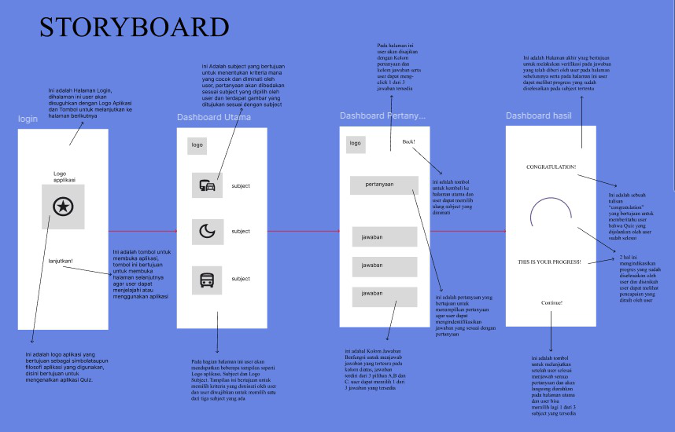
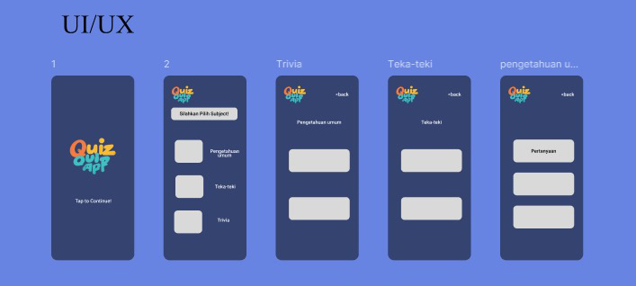

# PemrogramanMobile-1

## Profil

| Variable        | Isi             |
| --------------- | --------------- |
| **Nama**        | Dendi Permana   |
| **NIM**         | 312310694       |
| **Kelas**       | TI.23.A.6       |
| **Mata Kuliah** | Pemrograman Web |

### Pengenalan

Aplikasi Quiz Quiz App adalah aplikasi Quiz yang menyediakan soal-soal mulai dari pengetahuan umum dan teka-teki. yang bertujuan untuk melatih kemampuan kognitif seseorang

#### STORYBOARD

Deskripsi:

Storyboard digunakan untuk menguraikan keseluruhan struktur dan perjalanan pengguna di berbagai layar dan fungsi pada aplikasi Quiz

##### MOCK UP

Deskripsi:

Fungsi Mockup Pada Perancangan Aplikasi Quiz
Berfungsi sebagai pedoman ketika tengah mengerjakan desain supaya tidak mudah melenceng dari konsep awal

###### UI/UX

Salah satu tujuan utama dari UI/UX Design adalah menciptakan aplikasi yang menyenangkan dan memuaskan bagi pengguna.
